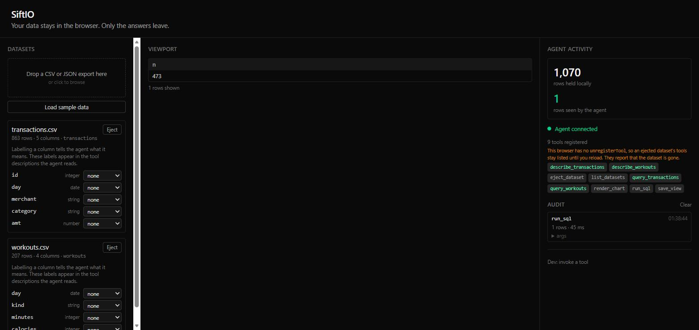

# SiftIO

**Your data stays in the browser. Only the answers leave.**

A local-first data vault. Drop in your CSV and JSON exports — bank statements, fitness
logs, app data dumps — and they load into a DuckDB instance running *inside the page*.
WebMCP tools then let an AI agent query, join and chart that data without any of it
being uploaded, while an audit panel shows you exactly what the agent read.

**Live:** https://siftio.marouane-kouskous.workers.dev



Built for [The WebMCP Challenge](https://webmcp.devpost.com/).
New here? **[docs/guide.md](docs/guide.md)** explains what it is for and how to drive it.
Working on it? **[docs/architecture.md](docs/architecture.md)** covers how it is built.

---

## Why WebMCP

Most agent integrations could just as easily be a server-side MCP. This one could not.

**There is nothing for a server-side MCP to connect to.** SiftIO has no backend, no API
and no database. Your data lives in browser memory and IndexedDB. A conventional MCP
server isn't a worse option here — it's an impossible one.

**Uploading the data would be incoherent.** A 400,000-row export doesn't fit in a context
window, and nobody sensibly uploads their bank history to answer one question. SiftIO
runs the query locally and returns only the handful of rows that answer it. The audit
panel keeps that honest: *1,070 rows held locally · 6 rows seen by the agent*.

**The toolset is a function of live page state.** Load a dataset and a `query_<table>`
tool appears, its input schema generated from that file's actual inferred columns. That
has no meaning for a static server-side toolset.

Removal is the one place the browser is still catching up: Chrome 152 exposes no
`unregisterTool`, so an ejected dataset's tools stay registered until you reload. SiftIO
calls `unregisterTool` when it exists, and otherwise says so in the UI rather than
pretending — the stale tool reports that its dataset is gone.

### What is actually private, precisely

Worth being exact, because overclaiming here would be the easy lie:

- Your file is **never uploaded**. Parsing, querying and joining all happen in the page.
- Query **results** the agent asked for do go to the agent — that is the point. The audit
  panel counts exactly how many rows that was.
- The DuckDB WebAssembly bundle is fetched from jsDelivr. That is program code coming
  *in*, not your data going *out*.

---

## Tool catalogue

### Always registered

| Tool | What it does | Annotation |
|---|---|---|
| `list_datasets` | Every loaded dataset with row counts and column schemas. The agent's entry point. When the vault is empty it says how to fill it. | `readOnlyHint` |
| `list_samples` | The bundled demo datasets available to load. | `readOnlyHint` |
| `load_sample` | Loads one bundled sample into the vault, labels and all. | — |
| `run_sql` | A single read-only `SELECT` across all loaded tables — this is what enables cross-dataset joins. Capped at 1,000 rows. | `readOnlyHint` |
| `render_chart` | Runs a query and draws it in the viewport, so the human sees what the agent found. | `readOnlyHint` |
| `save_view` | Pins a named query and chart to the board so it outlives the conversation. | — |
| `eject_dataset` | Removes a dataset. Asks the human to confirm first. | `destructiveHint` |

### Registered per dataset

Loading `transactions.csv` registers both of these and ejecting it removes them:

| Tool | What it does |
|---|---|
| `query_transactions` | Filter, aggregate, sort and limit that dataset. **Its input schema is generated from the file's real columns**, so the agent sees actual column names as typed enums — numeric filters only on numeric columns, date ranges only on dates. |
| `describe_transactions` | Per-column statistics: type, null count, distinct count, min/max. Lets the agent orient itself before querying. |

### Safety

`run_sql` accepts a single `SELECT` or `WITH … SELECT` and nothing else. String literals
and comments are blanked before keyword scanning, so `WHERE note = 'drop table t'` is
accepted while an actual `DROP` is rejected. Every column name, operator and aggregate
function an agent supplies to `query_<table>` is validated against an allowlist rather
than interpolated.

### An agent arrives at an empty vault

An agent opens this page in *its own* browsing context, with its own IndexedDB. Data you
loaded in your browser is invisible to it. Without a way to load data itself it would
reach an empty table and stop, so `list_datasets` explains the situation and
`list_samples` / `load_sample` let it bootstrap from the bundled library.

Only bundled samples can be loaded this way. Your own files come in by dropping them on
the page — an agent cannot reach your filesystem.

### Column labels change what the agent can do

Labelling a column is not a caption — it rewrites the generated tool schema:

| Label | Effect on `query_<table>` |
|---|---|
| `amount` | Becomes the default measure for aggregation and is listed first |
| `timestamp` | Unlocks `since` / `until` date-range filters, absent otherwise |
| `category` | Leads the `groupBy` list, ahead of columns that make poor groupings |
| `identifier` | **Removed** from the aggregate list — `sum(id)` is meaningless |

So on an unlabelled dataset the agent gets no date range at all, and `id` is offered as
something to average. Label the columns and the tool it sees is a different, sharper
tool. Date bounds are validated against a strict literal pattern before reaching SQL.

### Elicitation

When a `run_sql` query mentions a bare column name that exists in more than one loaded
dataset, SiftIO asks the human which was meant rather than guessing. `eject_dataset`
always asks before dropping anything.

---

## Trying it

### With an agent

WebMCP needs a Chrome with the flag enabled (verified on Chrome 152):

1. Open `chrome://flags/#enable-webmcp-testing`
2. Set it to **Enabled** and restart Chrome
3. Open the live URL and click **Load sample data**

Or open the live URL in ChatGPT's in-app browser, which supports WebMCP natively.

Then ask your agent something that needs both datasets:

> Which spending category is highest on days I worked out, and chart it.

Confirm the tools are visible from the console:

```js
await document.modelContext.getTools()      // 9 tools once samples are loaded
```

And invoke one directly — note that `executeTool` takes the registered tool object from
`getTools()`, and its arguments as a JSON **string**:

```js
const mc = document.modelContext;
const runSql = (await mc.getTools()).find(t => t.name === 'run_sql');
await mc.executeTool(runSql, JSON.stringify({
  sql: 'SELECT count(*) AS n FROM transactions JOIN workouts USING (day)'
}));
```

The API lives on `document.modelContext`, not `navigator.modelContext` — several
third-party write-ups say otherwise. SiftIO checks `document` first and falls back to
`navigator`.

### Without an agent

SiftIO works with no agent attached — you can load data, browse it and run saved views.
The **Dev: invoke a tool** panel in the Agent Activity pane invokes any registered tool
directly with hand-written JSON arguments. It goes through the same code path a real
agent hits, so calls appear in the audit feed identically.

### Sample data

**Load sample data** loads a three-dataset starter set — transactions, workouts and
sleep — which share a `day` column, so a cross-dataset question works immediately.
**Sample library** under it holds 14 synthetic datasets (5,178 rows total), each
loadable on its own or all at once.

| File | What it is | Rows | Notes |
|---|---|---:|---|
| `transactions.csv` | Bank transactions | 941 | A year of spending, including refunds as negative amounts. |
| `workouts.csv` | Workouts | 186 | Exercise sessions. Joins to the other daily sets on day. |
| `sleep.csv` | Sleep | 333 | Nightly hours and quality. |
| `steps.csv` | Daily steps | 365 | Step and floor counts for every day of 2025. |
| `weight.csv` | Body weight | 52 | Weekly readings, with some body-fat measurements missing. |
| `streaming.csv` | Music streaming | 643 | Play history with a full timestamp and a skipped flag. |
| `screen-time.csv` | Screen time | 1,001 | Minutes and pickups per app per day. |
| `commutes.csv` | Commutes | 261 | Weekday journeys by mode, with delays. |
| `groceries.csv` | Groceries | 162 | Receipt lines with unicode names and quoted commas. |
| `emails.csv` | Email metadata | 415 | Headers only. Subjects contain commas and quotes. |
| `subscriptions.json` | Subscriptions | 8 | JSON. Recurring charges and renewal dates. |
| `heart-rate.json` | Heart rate | 720 | JSON with timestamped readings by context. |
| `2024-taxes.csv` | 2024 taxes | 8 | Income and deductions. Filename starts with a digit. |
| `location-visits.csv` | Location visits | 83 | Places visited, with coordinates. |

Each ships with **column labels** in `public/samples/index.json`, applied on load.
Regenerate everything with `node scripts/make-samples.mjs`.

The set deliberately covers what breaks naive ingest: CSV and JSON, `DATE` and
`TIMESTAMP`, booleans, NULLs, negative numbers, unicode, fields containing commas and
quotes, and a filename starting with a digit (`2024-taxes.csv` becomes table
`t_2024_taxes`, since SQL identifiers cannot).

Your own exports work the same way — drop any CSV or JSON.

---

## Local development

Requires Node ≥ 24 (or use the included container, which pins it).

```bash
npm install
npm start                    # http://localhost:4200
npm test -- --watch=false    # 150 tests
npm run build
```

With Docker instead:

```bash
docker compose up                          # dev server on :4200
docker compose run --rm dev npm test -- --watch=false
```

Deployment is a Cloudflare static-asset Worker; `wrangler.jsonc` holds the config.

```bash
npm run deploy       # clean, build, publish
```

Use `npm run deploy` rather than `ng build && wrangler deploy`. Angular's persistent
build cache once served a stale module and shipped a bundle that did not match the
source — with every test still passing, because Vitest transforms fresh. `npm run clean`
removes `.angular/cache` and `dist` first.

---

## Architecture

Angular 21 (standalone, zoneless, signals), TypeScript strict, Tailwind, DuckDB-wasm,
Chart.js, IndexedDB via idb-keyval. Static files only — there is no server component,
which is itself part of the pitch.

| File | Responsibility |
|---|---|
| `core/duck.ts` | duckdb-wasm lifecycle, queries, CSV/JSON ingest |
| `core/vault.ts` | Dataset registry, IndexedDB persistence, rehydration |
| `core/mcp.ts` | **The only file touching the WebMCP API** |
| `core/tool-schema.ts` | Generates per-dataset schemas and safe SQL |
| `core/sql-guard.ts` | The read-only boundary for agent SQL |
| `core/audit.ts` | Invocation log and the rows-seen counter |

Two design decisions worth knowing:

**Tool registration is reactive, not imperative.** Nothing in the UI calls
`registerTool`. `McpService` runs an effect over the vault's dataset signal, so adding a
dataset is the only thing needed to make its tools appear.

**DuckDB does the parsing.** There is no CSV parser dependency — `read_csv_auto` and
`read_json_auto` handle reading and type inference, and `DESCRIBE` returns the schema.

---

## Licence

MIT — see [LICENSE](LICENSE).
